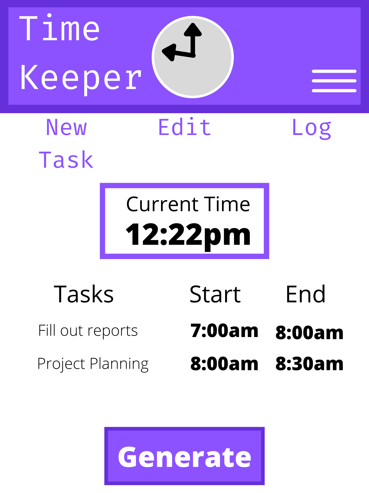
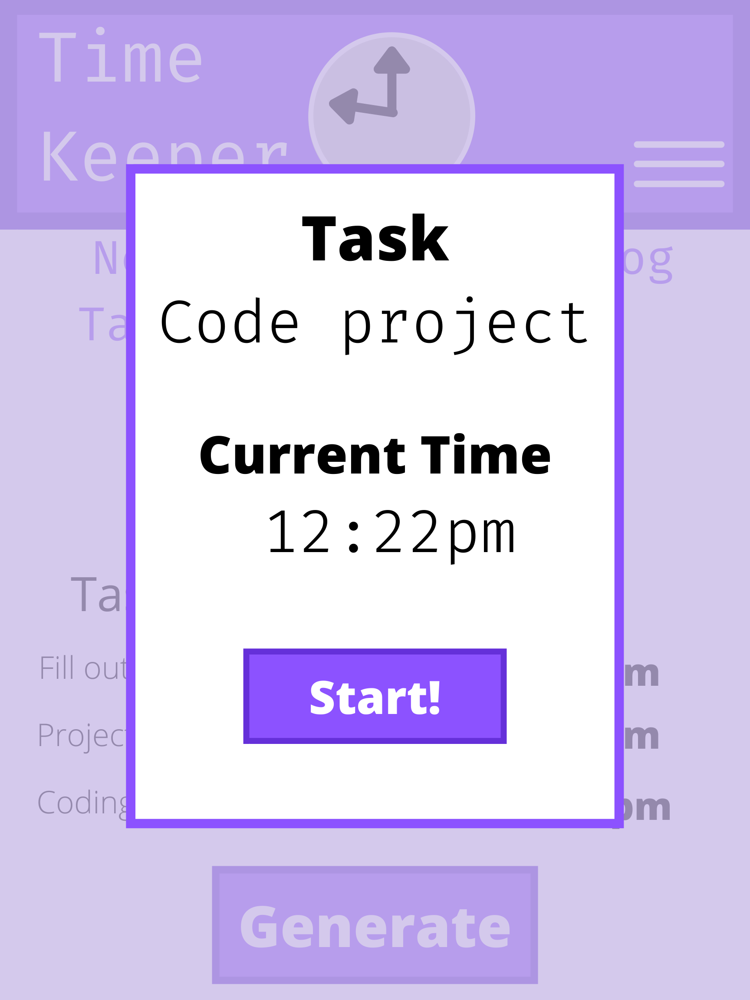

# Time Keeper
## Wireframes
### Application Overview
- Key Features
    - New task button
    - Edit task button
    - Log of the day / week
    - Current time
    - Hamburger Menu (mobile - will contain previously mentioned buttons)
    - Current Tasks
    - Generate Spreadsheet Button

### Create Task Modal
- Key Features
    - Task name Input
    - Current Time
    - "Start" Task Button

## Project Overview
- Time Keeper is an application made with VueJS to allow self-employed individuals to keep track of daily schedules. 
- Rather than manually inputting tasks with start & end times into a spreadsheet, users can quickly and intuitively enter in a task, while Time Keeper handles the start time for each task. 
- When a user is complete with the task they can end the timer for the task, and Time Keeper will log the completed task.
- When a user is finished for the day, they can press the "Generate" button, to have Time Keeper create a Microsoft Excel Spreadsheet with the organized list of tasks for that date.

## MVP Goals
- Users can enter a task
- Time keeper will display the user's current time
- A user can edit current / previous tasks
- Users can view current task
- Spreadsheet is generated when Generate button is pressed OR Generate button displays information as JSON (To possibly be used when spreadsheet generator is hooked up)